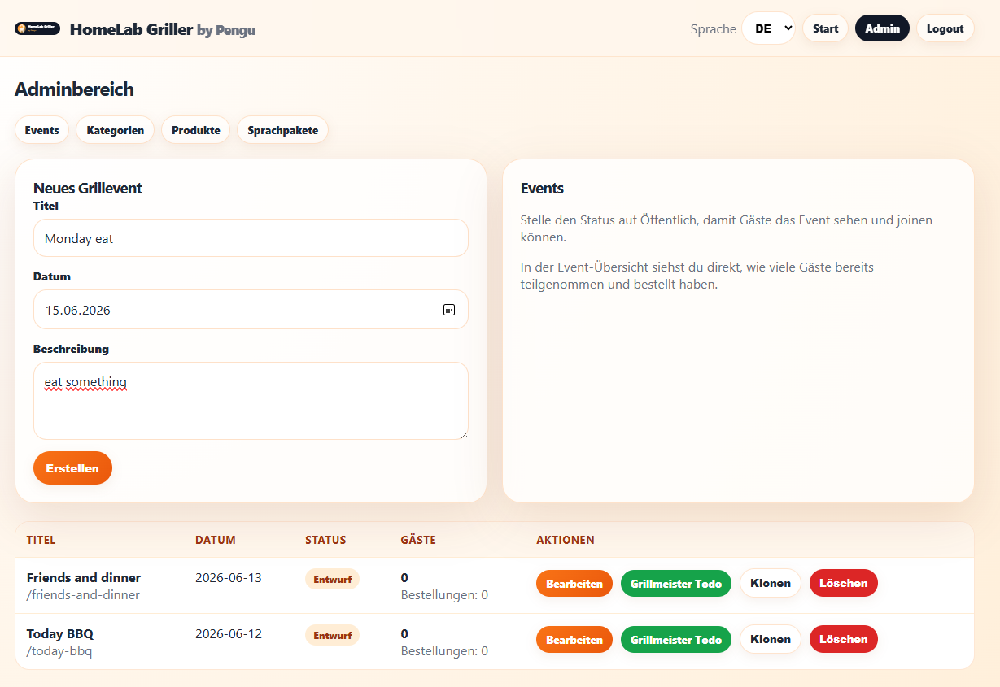
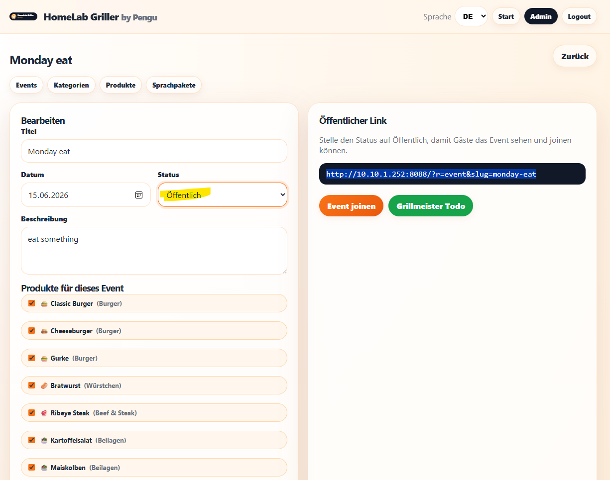
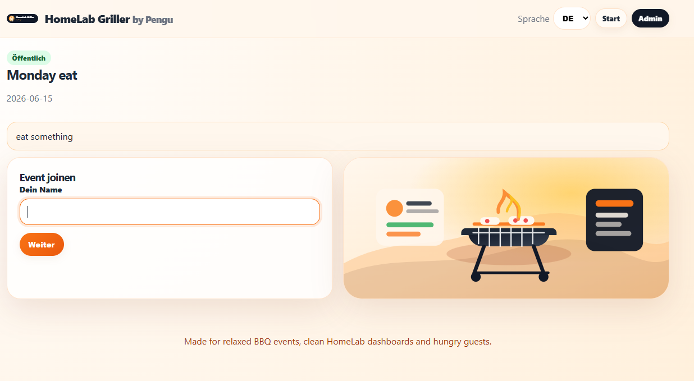
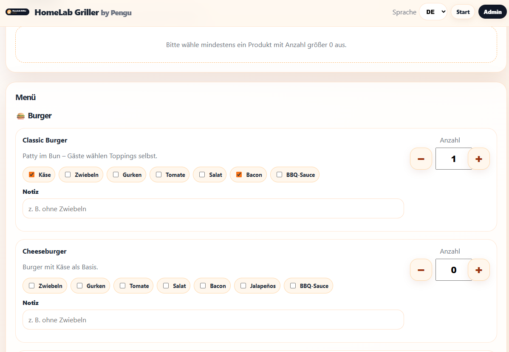
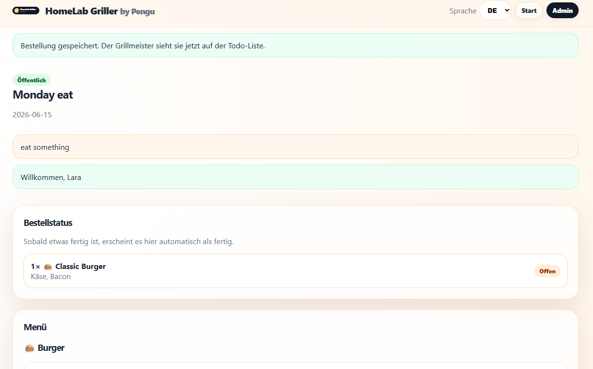
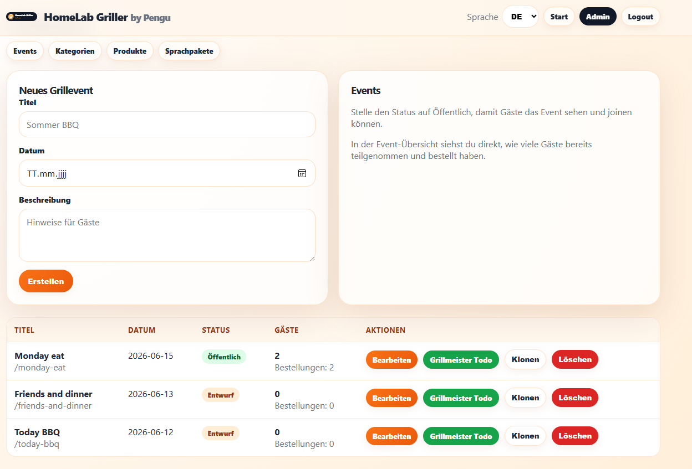
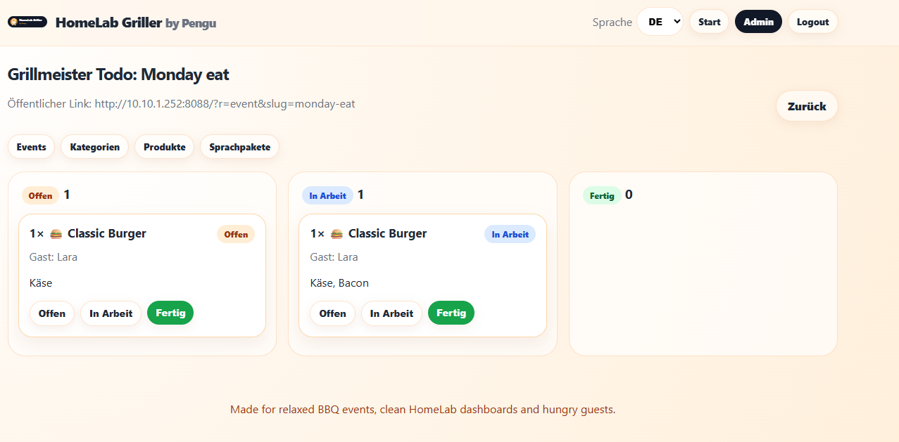

# HomeLab Griller by Pengu

A clean, modern and self-hosted BBQ event planner for HomeLab setups. Create BBQ events, publish them for guests, let guests build their own orders and work through everything in a simple grill-master todo board.


## In short: What does this tool do?

HomeLab Griller is a self-hosted BBQ event planner and order dashboard for private grill events, parties and HomeLab setups.

As an admin, you can define what you bought for your BBQ event and create custom products such as a “PenguBurger”. For each product, you can add selectable options like cucumber, onions, tomato, cheese, toasted burger bun, BBQ sauce or garlic sauce.

Guests can join the public event page, enter their name and build their own order exactly the way they want it. They can choose options, set quantities and add notes.

As the grill master, you get a clean todo board with all guest orders. You can see who ordered what, prepare each item step by step and mark orders as in progress or finished. Guests can then see the status of their order directly on their own event page.


## Features

- Self-hosted Docker container
- PHP + SQLite, no external database required
- Password-protected admin area
- Default admin user: `Griller`
- Admin password is configured at container runtime with `GRILLER_ADMIN_PASSWORD`
- German and English included
- Extendable JSON language packs uploadable in the admin area
- Global reusable categories such as burgers, sausages, sides, drinks and desserts
- Product catalog with toppings/options
- Mobile-friendly guest order page with large `-` / `+` quantity buttons
- Doneness selection for beef/steak products
- BBQ events can be created, published, closed, deleted and cloned
- Guests join public events with their name
- Guests can build their own menu/order and see the order status at the top of the event page
- Admin can see all joined guests per event
- Guests can be removed from an event, including their orders
- Grill-master todo board with `Pending`, `In progress` and `Done`
- Persistent SQLite database in the mounted `data` directory

## Screenshots

| Screenshot | Area |
| --- | --- |
| ` | Admin |
| ` | Menu |
| ` | NewGuest |
| ` | Guestorder |
| ` | Meal status |
| ` | Admin |
| ` | ToDoList |


## Container image

The recommended public image name for this repository is:

```text
ghcr.io/borderlane-ha/homelab-griller:latest
```

If you fork or rename the repository, replace `borderlane-ha/homelab-griller` with your own GitHub owner and repository name.

## Run with Docker Compose

Create a folder on your Docker host:

```bash
mkdir -p homelab-griller/data homelab-griller/lang
cd homelab-griller
```

Create `docker-compose.yml`:

```yaml
services:
  homelab-griller:
    image: ghcr.io/borderlane-ha/homelab-griller:latest
    container_name: homelab-griller
    restart: unless-stopped
    ports:
      - "8091:80"
    environment:
      GRILLER_ADMIN_PASSWORD: "change-this-password"
      GRILLER_DEFAULT_LANGUAGE: "de"
      TZ: "Europe/Berlin"
    volumes:
      - ./data:/var/www/html/data
      - ./lang:/var/www/html/lang/custom
```

Start the container:

```bash
docker compose up -d
```

Open the app:

```text
http://SERVER-IP:8091
```

Admin login:

```text
User: Griller
Password: value from GRILLER_ADMIN_PASSWORD
```

## Run with Docker CLI

```bash
docker run -d \
  --name homelab-griller \
  --restart unless-stopped \
  -p 8091:80 \
  -e GRILLER_ADMIN_PASSWORD="change-this-password" \
  -e GRILLER_DEFAULT_LANGUAGE="de" \
  -e TZ="Europe/Berlin" \
  -v ./data:/var/www/html/data \
  -v ./lang:/var/www/html/lang/custom \
  ghcr.io/borderlane-ha/homelab-griller:latest
```

## Password handling

The admin password is not baked into the Docker image. It is read when the container starts.

Set it with:

```yaml
environment:
  GRILLER_ADMIN_PASSWORD: "your-secure-password"
```

The admin username is always:

```text
Griller
```

If you change `GRILLER_ADMIN_PASSWORD`, recreate or restart the container:

```bash
docker compose up -d
```

The SQLite database remains untouched because it is stored in the mounted `./data` folder.


## Update

When using the published image:

```bash
docker compose pull
docker compose up -d
```

When building locally from the source code:

```bash
git pull
docker compose up -d --build
```

## Backup

Stop the container and copy the data directory:

```bash
docker compose down
cp -a data data-backup-$(date +%Y%m%d)
docker compose up -d
```

The SQLite database is stored here:

```text
./data/griller.sqlite
```

Uploaded language packs are stored here:

```text
./data/lang/
```

## Proxmox Install Script

HomeLab Griller can be installed on Proxmox VE with a single command.
Run the following command directly on your Proxmox host:

```bash
bash -c "$(curl -fsSL https://raw.githubusercontent.com/Borderlane-HA/homelab-griller/main/scripts/proxmox-lxc-install.sh)"
```
The root password will be displayed at the end of the installation.

The installer will create a Debian LXC container, install Docker, deploy HomeLab Griller and start the application automatically.

During installation, you will be asked for a few values:

```text
Choose a free Container ID
Choose a hostname, for example: homelab-griller
Storage [local-lvm]:
Bridge [vmbr0]:
Network IP config [dhcp] (use dhcp or e.g. 192.168.1.50/24,gw=192.168.1.1):
App port [8091]:
Admin password for user Griller:
```

You can press **Enter** to accept the default values shown in brackets.

After the installation has finished, open HomeLab Griller in your browser:

```text
http://<LXC-IP>:8091
```

Login to the admin area with:

```text
Username: Griller
Password: the password you entered during installation
```


## Language packs

Built-in languages:

- `de`
- `en`

Admins can upload additional JSON language packs in the admin area. Use a short language code such as `fr`, `it`, `es`, `nl`.

Example:

```json
{
  "hero_title": "Le planificateur barbecue moderne pour ton HomeLab.",
  "join_event": "Rejoindre l'événement",
  "menu": "Menu",
  "send_order": "Envoyer la commande",
  "done": "Terminé"
}
```

Missing translation keys fall back to the built-in language files.

A sample file is included at:

```text
docs/example-fr.json
```

## Recommended first setup inside the app

1. Open the admin area.
2. Check the default categories.
3. Add or edit products.
4. Create a BBQ event.
5. Select the products available for that event.
6. Publish the event.
7. Share the public event link or QR code with guests.
8. Open the grill-master todo board during the BBQ.

## Security notes

- Always change `GRILLER_ADMIN_PASSWORD` before exposing the app.
- Use a reverse proxy with HTTPS when the app is reachable outside your LAN.
- SQLite is ideal for small private BBQ events. For very large public use, a larger database backend would be a future improvement.

## Roadmap ideas

- ~~Built-in QR code per public event~~
- ~~Optional guest PIN or invitation code~~
- Shopping list export grouped by category
- Print-friendly kitchen tickets
- Home Assistant webhook notifications
- Dark mode
- ~~Drag-and-drop sorting for categories and products~~

## License

MIT
